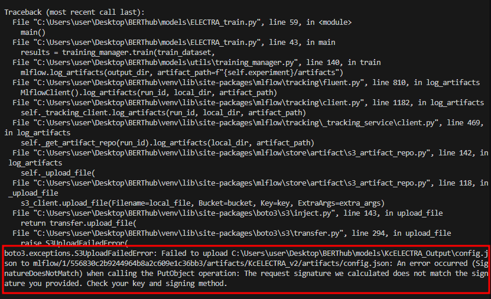

# 언어모델을 활용한 혐오표현 마스킹 서비스(가제)

1. 브랜치 전략 

```bash
  dev
    ├── feature/MLops
    ├── feature/api
    ├── feature/electra
    ├── feature/nginx
* main
```

- 기능별로 브랜치 개설하며 생성 예정

- 현재 완료 내용 → `BERT`, `ELECTRA`, 학습 완료 / 실험실 구축 완료

2. `nginx` 구축 

- 리버스 프록시 기반 : 포트 숨기고, 안전한 로드밸런싱을 위해서 구축 

`Error` : 문제가 무엇인지? 



- boto3 기반으로 운영하는 minio api가 연결되지 않는 문제가 발생 
- 후술은 귀찮아서 나중에 서술